📍 **Central Florida** &nbsp;·&nbsp; 🤖 **Forward-Deployed AI & Systems Engineer** &nbsp;·&nbsp; 🎓 **CS @ UCF (Dec 2026)**

> I design, deploy, and operate autonomous AI systems and production SaaS — multi-agent automation, media pipelines, and trading bots on one side; WebRTC voice platforms, power dialers, and CRMs on the other. I ship fast, automate everything, and let the work speak for itself.

<!-- Contribution snake (auto-generated every 12h by .github/workflows/snake.yml) -->

<picture>
  <source media="(prefers-color-scheme: dark)" srcset="https://raw.githubusercontent.com/chang-pro/chang-pro/output/github-snake-dark.svg" />
  <source media="(prefers-color-scheme: light)" srcset="https://raw.githubusercontent.com/chang-pro/chang-pro/output/github-snake.svg" />
  
</picture>

---

## 🏆 Awards & Open Source

### 🥇 1st Place — Google Gemini Hackathon (BloomKnights)

Architected a **real-time sports prediction market**: edge-device camera feeds from **Ray-Ban Meta** glasses capture the live game, **Gemini** orchestration extracts team stats on the fly, and the system streams back **dynamic win probabilities** as the play unfolds.

`Gemini` `LLM Orchestration` `Ray-Ban Meta` `Real-Time Vision` `Prediction Markets`

### 🔓 Open Source Contributions

Contributing fixes to the data & AI infrastructure I build on every day — **1 merged upstream, more in review** across major projects:

| Project | Contribution | Status |
|---|---|---|
| [**streamlit**](https://github.com/streamlit/streamlit/pull/15949) | Fix `RuntimeError: reentrant call inside _io.BufferedWriter` on Ctrl+C | ✅ **Merged** |
| [**pandas**](https://github.com/pandas-dev/pandas/pull/66304) | Fix `loc`/`iloc` setitem with empty / boolean column indexer on EA dtypes | 🟢 Open |
| [**scikit-learn**](https://github.com/scikit-learn/scikit-learn/pull/34464) | Fix `OrdinalEncoder` crash on numeric transform data with object-dtype categories | 🟢 Open |
| [**dask**](https://github.com/dask/dask/pull/12502) | Skip rechunk in `to_zarr` when chunks already align with the target array | 🟢 Open |
| [**Chart.js**](https://github.com/chartjs/Chart.js/pull/12275) | Don't run tooltip content callbacks when all items are filtered out | 🟢 Open |
| [**cypress**](https://github.com/cypress-io/cypress/pull/34283) | Don't inject into commented-out `head`/`body`/`html` tags | 🟢 Open |

---

## 🤖 AI Automation & Agents

### 🎬 [ClipPro](https://github.com/chang-pro/clippro) — Free Opus Clip Alternative `Open Source`

> Turn long videos into viral clips — runs locally, no subscriptions, no cloud uploads.

Built with **Whisper (GPU)** + **Gemini AI** + **FFmpeg**. Transcribes your video, scores the highest-virality moments with AI hook ranking, then cuts 9:16 clips with karaoke captions and hook overlays. Includes a web UI and a clip combiner.

`Python` `Flask` `faster-whisper` `Gemini 2.5 Flash` `FFmpeg` `OpenCV`

### 🖼️ [Meta AI MCP](https://github.com/chang-pro/meta-ai-mcp) — Free image + video generation via Meta AI `Source Available`

> Generate AI videos from Claude Code for free — no API key, no subscription.

Reverse-engineered Meta AI Vibes to expose a working MCP tool and CLI. Browser-driven CDP automation because Meta sends prompts over protobuf WebSocket — no pure-HTTP client exists. Text→video and image→video both work. ~30-90s per clip.

`Python` `MCP` `Chrome CDP` `agent-browser` `FFmpeg` `Reverse Engineering`

### 🔗 [LinkedIn MCP](https://github.com/chang-pro/linkedin-mcp) — LinkedIn Browser Automation MCP `Source Available`

> Post, comment, like, and DM on LinkedIn from Claude Code — no official API, no $300/month tools.

Browser-driven CDP automation using your real logged-in Chrome session. Five MCP tools: post (with image), comment, like, DM, and session status check.

`Python` `MCP` `Chrome CDP` `LinkedIn`

## 📈 Algorithmic Trading

### 🎯 [no-backtest-drift](https://github.com/chang-pro/no-backtest-drift) — Live/Backtest Parity Pattern `Source Available`

> Stop your trading bot from lying to you. One pattern: live engine delegates to backtest engine. Zero drift.

The #1 silent killer in algo bots is live-vs-backtest divergence. This pattern fixes it structurally — the live engine has no entry logic of its own; it calls the backtest engine's exact `should_enter()`. One brain, used in both places. 10 tests document every config-default trap and verify parity on every bar.

`Python` `Algorithmic Trading` `IBKR` `Backtesting` `pytest`

## 📞 Voice, Telephony & SaaS

- 📟 **Ringora** — Multi-tenant SaaS CRM & power dialer: Telnyx WebRTC, Stripe billing, AI call analysis, Rust WASM

## 📊 Building in Public

- 🛠️ **[daily-builds](https://github.com/chang-pro/daily-builds)** — a public log of what I ship most days. Project repos stay private; the cadence is public.
- 🌱 **[openai-chart-data-analyzer](https://github.com/chang-pro/openai-chart-data-analyzer)** — one of my first builds (2022): a PyQt GUI querying GPT-3 on chart data. Kept as a marker of how far the work has come.

---

## 📊 GitHub Stats

---

## What I'm About

- **Shipping production software** — SaaS platforms, telephony systems, AI pipelines, and trading bots running in prod
- **AI-native development** — building with Claude, Gemini, and custom multi-agent systems to move faster
- **Voice & telephony engineering** — WebRTC, Twilio, Telnyx, Vapi — browser-based calling is my thing
- **Automating everything** — if it can be automated, it should be

## Connect

---

> Most projects are **closed source** and in active development. If you're interested for hiring, collaboration, or licensing — reach out. Open source contributions are marked above.
